# Cellytics System - Class Diagram

## Overview

This class diagram shows the complete class structure for both backend (Python/FastAPI) and frontend (Flutter/Dart) components, including:

- **Backend ORM Models** (SQLAlchemy) - Data persistence layer
- **Backend Services** - Business logic layer
- **Frontend Data Models** (Dart) - Data structures
- **Frontend Services** - API & local storage integration
- **Frontend Providers** (Riverpod) - State management
- **Frontend Screens** - UI components
- **Enumerations** - Shared types
- **Relationships** - Dependencies and associations

---

## Full Class Diagram

```mermaid
classDiagram
    %% ═══════════════════════════════════════════════════════════════
    %% BACKEND: ORM Models (Python/SQLAlchemy)
    %% ═══════════════════════════════════════════════════════════════

    class Region {
        +UUID id
        +String name
        +String description
        +DateTime created_at
        +Zone[] zones
    }

    class Zone {
        +UUID id
        +String name
        +String location
        +UUID region_id
        +UUID zonal_pastor_id
        +UUID zonal_admin_id
        +DateTime created_at
        +Region region
        +Fellowship[] fellowships
        +User zonal_pastor
        +User zonal_admin
    }

    class Fellowship {
        +UUID id
        +String name
        +String location
        +UUID zone_id
        +UUID pastor_id
        +DateTime created_at
        +Zone zone
        +SeniorCell[] senior_cells
        +User pastor
    }

    class SeniorCell {
        +UUID id
        +String name
        +UUID fellowship_id
        +UUID leader_id
        +String leader_name
        +DateTime created_at
        +Fellowship fellowship
        +Cell[] cells
        +User leader
    }

    class Cell {
        +UUID id
        +String name
        +UUID senior_cell_id
        +UUID leader_id
        +String leader_name
        +String default_meeting_day
        +String actual_meeting_day
        +Time meeting_time
        +Boolean is_active
        +DateTime created_at
        +SeniorCell senior_cell
        +User leader
        +CellReport[] cell_reports
    }

    class User {
        +UUID id
        +String phone
        +String name
        +String pin_hash
        +UserRole role
        +UUID cell_id
        +UUID senior_cell_id
        +UUID fellowship_id
        +UUID zone_id
        +Boolean is_active
        +DateTime last_login
        +DateTime created_at
        +Cell cell
        +SeniorCell senior_cells_led
        +Fellowship fellowships_led
        +Zone zones_as_pastor
        +Zone zones_as_admin
        +CellReport[] reports_submitted
    }

    class CellReport {
        +UUID id
        +UUID cell_id
        +UUID submitted_by_id
        +DateTime report_date
        +Integer attendance_count
        +Integer new_members_count
        +Integer first_timers
        +Integer souls_won
        +Decimal tithes_given
        +Decimal offerings_given
        +Decimal special_offerings
        +Boolean praise_worship
        +Boolean word_study
        +Boolean prayer
        +String testimonies
        +String challenges
        +String monthly_plans
        +ReportStatus status
        +DateTime submitted_at
        +DateTime created_at
        +Cell cell
        +User submitted_by
    }

    class Notification {
        +UUID id
        +UUID user_id
        +String title
        +String body
        +String notification_type
        +Boolean is_read
        +DateTime created_at
        +User user
    }

    %% ═══════════════════════════════════════════════════════════════
    %% BACKEND: Services
    %% ═══════════════════════════════════════════════════════════════

    class AdminService {
        -session: AsyncSession
        +create_zone(request)
        +update_zone(zone_id, request)
        +delete_zone(zone_id)
        +create_fellowship(request)
        +create_cell(request)
        +create_user(request)
        +assign_user_to_cell(user_id, cell_id)
        +validate_hierarchy()
    }

    class ReportService {
        -session: AsyncSession
        +submit_report(report_data)
        +validate_report(report)
        +calculate_status(report)
        +get_reports_by_cell(cell_id)
        +get_reports_by_user(user_id)
        +export_report(report_id)
    }

    class DashboardService {
        -session: AsyncSession
        +get_overview(user: User)
        +get_cell_metrics(cell_id, user)
        +get_zone_analytics(zone_id, user)
        +get_fellowship_analytics(fellowship_id, user)
        +calculate_trends(filters)
        +aggregate_stats(reports)
    }

    class FCMService {
        -firebase_app
        +register_device_token(user_id, token)
        +send_notification(user_id, title, body)
        +send_topic_notification(topic, title, body)
        +send_batch_notifications(user_ids, message)
    }

    class AuthService {
        +hash_pin(pin)
        +verify_pin(pin, pin_hash)
        +create_access_token(user_id)
        +verify_token(token)
        +decode_token(token)
    }

    %% ═══════════════════════════════════════════════════════════════
    %% FRONTEND: Data Models (Flutter/Dart)
    %% ═══════════════════════════════════════════════════════════════

    class UserModel {
        +String id
        +String phone
        +String name
        +UserRole role
        +String cell_id
        +String senior_cell_id
        +String fellowship_id
        +String zone_id
        +Boolean is_active
        +bool canViewCell(cellId)
        +bool isLeaderOf(cellId)
        +fromJson()
        +toJson()
    }

    class CellReportModel {
        +String id
        +String cellId
        +String cellName
        +DateTime meetingDate
        +Integer attendanceCount
        +Integer newMembersCount
        +Double tithesGiven
        +Double offeringsGiven
        +String testimonies
        +String challenges
        +ReportStatus status
        +DateTime submittedAt
        +DateTime createdAt
        +double getTotalFinances()
        +bool isDraft
        +fromJson()
        +toJson()
    }

    class CellSummaryModel {
        +String id
        +String name
        +String meetingDay
        +String meetingTime
        +String seniorCellId
        +Boolean is_active
        +fromJson()
    }

    %% ═══════════════════════════════════════════════════════════════
    %% FRONTEND: Services
    %% ═══════════════════════════════════════════════════════════════

    class APIService {
        -_dio: Dio
        -_tokenBox: Box
        +login(phone, pin)
        +getReports()
        +submitReport(report)
        +getReportsByCell(cellId)
        +getDashboardData()
        +registerDeviceToken(token)
        -_initDio()
        -_refreshToken()
    }

    class LocalStorageService {
        -_authBox: Box
        -_reportsBox: Box
        -_syncQueueBox: Box
        +getToken()
        +saveToken(token)
        +getUser()
        +saveUser(user)
        +saveDraftReport(report)
        +getDraftReport(id)
        +addToSyncQueue(reportId)
        +getSyncQueue()
    }

    class SyncService {
        -apiService: APIService
        -localStorage: LocalStorageService
        +syncOfflineData()
        +monitorConnectivity()
        -_retryWithBackoff(report)
        -_markSyncFailed(reportId)
    }

    %% ═══════════════════════════════════════════════════════════════
    %% FRONTEND: State Management (Riverpod Providers)
    %% ═══════════════════════════════════════════════════════════════

    class AuthProvider {
        -_localStorage: LocalStorageService
        -_apiService: APIService
        +currentUser: UserModel
        +isLoggedIn: bool
        +login(phone, pin)
        +logout()
        +refreshUser()
    }

    class ReportProvider {
        -_apiService: APIService
        -_localStorage: LocalStorageService
        +draftReport: CellReportModel
        +submitReport()
        +updateField(field, value)
        +saveDraft()
        +loadDraft(reportId)
    }

    class ConnectivityProvider {
        -connectivity: Connectivity
        +isOnline: Stream~bool~
        +onConnectivityChanged()
    }

    class ReportsListProvider {
        -_apiService: APIService
        +reports: Future~List~CellReport~~
        +fetchReports()
        +filter(dateRange)
    }

    %% ═══════════════════════════════════════════════════════════════
    %% FRONTEND: UI Screens
    %% ═══════════════════════════════════════════════════════════════

    class LoginScreen {
        -phone: String
        -pin: String
        +build()
        +validateInputs()
        +handleLogin()
    }

    class ReportFormScreen {
        -report: CellReportModel
        -currentPage: int
        +build()
        +nextPage()
        +previousPage()
        +submitReport()
    }

    class ReportHistoryScreen {
        +reports: List~CellReport~
        +build()
        +filterByDate()
        +onReportTap()
    }

    class DashboardScreen {
        +stats: DashboardData
        +build()
        +refreshData()
    }

    class ProfileScreen {
        +user: UserModel
        +build()
        +handleLogout()
    }

    %% ═══════════════════════════════════════════════════════════════
    %% ENUMS
    %% ═══════════════════════════════════════════════════════════════

    class UserRole {
        <<enumeration>>
        SYSTEM_ADMIN
        ZONAL_PASTOR
        ZONAL_ADMIN
        FELLOWSHIP_PASTOR
        SENIOR_CELL_LEADER
        CELL_LEADER
    }

    class ReportStatus {
        <<enumeration>>
        DRAFT
        SUBMITTED
        LATE
        OVERDUE
    }

    %% ═══════════════════════════════════════════════════════════════
    %% RELATIONSHIPS
    %% ═══════════════════════════════════════════════════════════════

    %% Backend ORM relationships
    Region "1" --> "N" Zone
    Zone "1" --> "N" Fellowship
    Fellowship "1" --> "N" SeniorCell
    SeniorCell "1" --> "N" Cell
    Cell "1" --> "N" CellReport

    Zone "1" --> "N" User : zonal_pastor
    Zone "1" --> "N" User : zonal_admin
    Fellowship "1" --> "N" User : pastor
    SeniorCell "1" --> "N" User : leader
    Cell "1" --> "N" User : leader

    User "1" --> "N" CellReport : submitted_by
    User "1" --> "N" Notification : receives

    %% Services to Models
    AdminService --> Region
    AdminService --> Zone
    AdminService --> Fellowship
    AdminService --> SeniorCell
    AdminService --> Cell
    AdminService --> User

    ReportService --> CellReport
    DashboardService --> CellReport
    FCMService --> Notification
    AuthService --> User

    %% Frontend Services
    APIService --> UserModel
    APIService --> CellReportModel
    LocalStorageService --> UserModel
    LocalStorageService --> CellReportModel
    SyncService --> APIService
    SyncService --> LocalStorageService

    %% Providers to Services
    AuthProvider --> APIService
    AuthProvider --> LocalStorageService
    ReportProvider --> APIService
    ReportProvider --> LocalStorageService
    ReportsListProvider --> APIService

    %% Screens to Providers
    LoginScreen --> AuthProvider
    ReportFormScreen --> ReportProvider
    ReportFormScreen --> ConnectivityProvider
    ReportHistoryScreen --> ReportsListProvider
    DashboardScreen --> AuthProvider
    ProfileScreen --> AuthProvider
```



---

## Class Groups

### Backend ORM Models (8 classes)

These SQLAlchemy models represent the database schema:

| Model            | Purpose                   | Key Relationships                            |
| ---------------- | ------------------------- | -------------------------------------------- |
| **Region**       | Geographic areas          | Has many Zones                               |
| **Zone**         | Zone subdivisions         | Has many Fellowships, managed by Users       |
| **Fellowship**   | Fellowship groups         | Has many SeniorCells, managed by User        |
| **SeniorCell**   | Senior cell groups        | Has many Cells, managed by User              |
| **Cell**         | Basic unit (5-10 members) | Has many CellReports, managed by User        |
| **User**         | Leaders & administrators  | Many roles, assigned to Cell/Zone/Fellowship |
| **CellReport**   | Weekly reports            | Submitted by User, belongs to Cell           |
| **Notification** | FCM notifications         | Assigned to User                             |

### Backend Services (5 classes)

Business logic layer handling:

| Service              | Responsibility     | Key Methods                                     |
| -------------------- | ------------------ | ----------------------------------------------- |
| **AdminService**     | Manage hierarchy   | Create/update zones, fellowships, cells, users  |
| **ReportService**    | Handle reports     | Submit, validate, calculate status, get reports |
| **DashboardService** | Generate analytics | Aggregate stats, trends, scope-aware queries    |
| **FCMService**       | Push notifications | Register devices, send messages, topics         |
| **AuthService**      | Authentication     | Hash PIN, verify, create/verify JWT tokens      |

### Frontend Data Models (3 classes)

Dart equivalents of backend models:

| Model                | Purpose       | Key Methods                                        |
| -------------------- | ------------- | -------------------------------------------------- |
| **UserModel**        | User info     | canViewCell(), isLeaderOf(), serialization         |
| **CellReportModel**  | Report data   | getTotalFinances(), status checking, serialization |
| **CellSummaryModel** | Cell metadata | Basic cell info for lists                          |

### Frontend Services (3 classes)

Integration & persistence:

| Service                 | Responsibility    | Key Methods                                 |
| ----------------------- | ----------------- | ------------------------------------------- |
| **APIService**          | HTTP requests     | Login, getReports, submitReport, dashboards |
| **LocalStorageService** | Local persistence | Token, user, drafts, sync queue management  |
| **SyncService**         | Offline sync      | Sync queued reports, retry with backoff     |

### Frontend Providers (4 providers)

State management via Riverpod:

| Provider                 | Type           | Purpose                                  |
| ------------------------ | -------------- | ---------------------------------------- |
| **AuthProvider**         | StateNotifier  | User login/logout, persistent auth state |
| **ReportProvider**       | StateNotifier  | Draft report creation, form state        |
| **ConnectivityProvider** | StreamProvider | Network status monitoring                |
| **ReportsListProvider**  | FutureProvider | Async report fetching from API           |

### Frontend Screens (5 screens)

User interface components:

| Screen                  | Purpose         | Providers Used                          |
| ----------------------- | --------------- | --------------------------------------- |
| **LoginScreen**         | Authentication  | AuthProvider                            |
| **ReportFormScreen**    | Multi-page form | ReportProvider, ConnectivityProvider    |
| **ReportHistoryScreen** | List & filter   | ReportsListProvider                     |
| **DashboardScreen**     | Quick stats     | AuthProvider, custom dashboard provider |
| **ProfileScreen**       | User settings   | AuthProvider                            |

---

## Dependency Flow

```
UI Screens
    ↓
Riverpod Providers (State Management)
    ↓
Frontend Services (APIService, LocalStorageService, SyncService)
    ↓
Backend API (FastAPI Routes)
    ↓
Backend Services (AdminService, ReportService, DashboardService, etc)
    ↓
ORM Models (SQLAlchemy)
    ↓
PostgreSQL Database
```

---

## Key Relationships

### Hierarchical Ownership (Backend)

```
Region
  └─ Zone (managed by zonal_pastor, zonal_admin)
      └─ Fellowship (managed by pastor)
          └─ SeniorCell (managed by leader)
              └─ Cell (managed by leader)
                  └─ CellReport (submitted by cell_leader)
```

### User Roles & Permissions

```
UserRole enum determines:
- What data user can view (scope)
- What operations user can perform
- Automatic scoping in queries
```

### Data Flow (Report Submission)

```
ReportFormScreen
    ↓
ReportProvider (manages draft state)
    ↓
ConnectivityProvider (checks online/offline)
    ↓
LocalStorageService (saves draft to Hive)
    ↓
APIService (submits when online)
    ↓
Backend ReportService (validates & stores)
    ↓
CellReport model (persisted in PostgreSQL)
```

---

## Design Patterns Used

### Backend

- **Dependency Injection** - Services receive dependencies via Depends()
- **Repository Pattern** - Services don't directly query; use repo abstractions
- **Service Layer** - Routes delegate to services, not models
- **ORM Pattern** - SQLAlchemy handles DB mapping

### Frontend

- **Provider Pattern** - Riverpod providers manage all state
- **Service Locator** - APIService, LocalStorageService provided via dependency injection
- **Observer Pattern** - Providers notify widgets of state changes
- **Repository Pattern** - Services abstract data sources (API, local)

---

## Class Complexity Analysis

### Simple Classes (Data Holders)

- Region, Zone, Fellowship, SeniorCell, Cell
- UserModel, CellReportModel, CellSummaryModel

### Medium Complexity (Relationships + Methods)

- User (multiple relationships, role hierarchy)
- CellReport (status tracking, calculations)
- APIService (HTTP setup, interceptors)

### High Complexity (Business Logic)

- DashboardService (aggregations, scoping, trends)
- SyncService (offline detection, retry logic, conflict resolution)
- ReportService (validation, status calculation)
- AdminService (hierarchy validation, permission checks)

---

## Extension Points

Future enhancements would add:

**Backend:**

- AnalyticsService (predictive metrics, exports)
- ExportService (PDF, Excel generation)
- WebSocketService (real-time updates)

**Frontend:**

- PhotoUploadService (camera integration)
- ExportProvider (report export state)
- SearchProvider (report search & filtering)

---

**Last Updated**: May 15, 2026  
**Version**: 1.0.0  
**Diagram Type**: Mermaid Class Diagram
